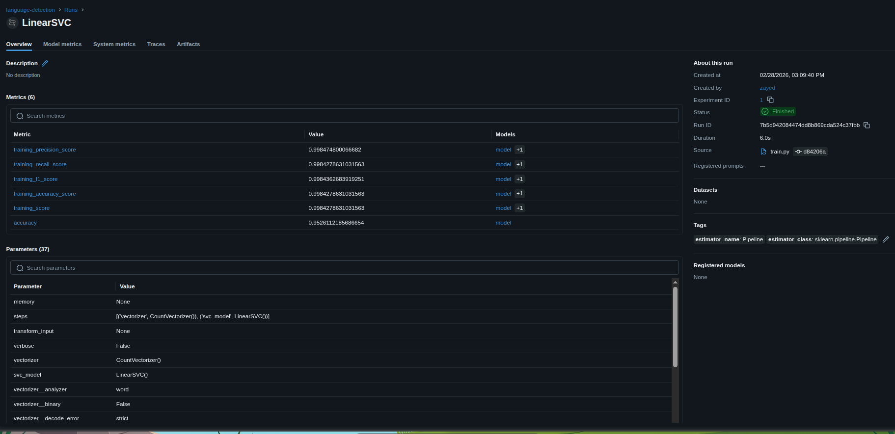
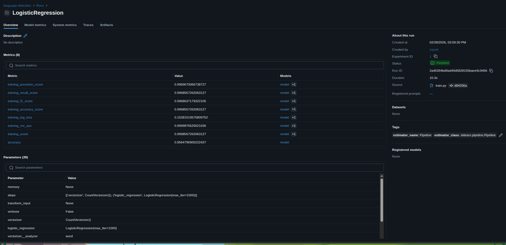
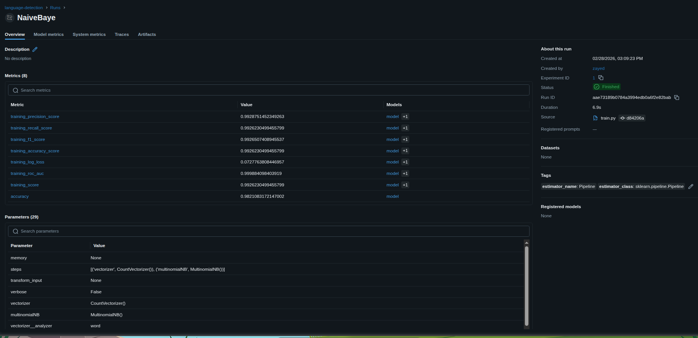

# Language Detection API

A language detection ML service built with FastAPI, Docker, and MLflow.

## What it does

Just a basic language detection I built for learning about MLflow and Docker
So thought to share it with you guys :)

Detects the language of input text using ML models (LinearSVC, LogisticRegression, NaiveBayes) tracked with MLflow. But for now 
Here I've used the naive_trained_pipeline-0.1.0.pkl
If you want to change the model just got to 
app/model/model.py and change the line 

```bash
{BASE_DIR}/naive_trained_pipeline-{__version__}.pkl
change the naive_trained to logistic_trained or svm_trained

**But before that make sure to run train.py file**
```

## Tech Stack
- FastAPI -> REST API
- Docker -> containerization  
- MLflow -> experiment tracking & model registry
- scikit-learn -> ML models

## Dataset
The dataset is downloaded from kaggle - [https://www.kaggle.com/datasets/basilb2s/language-detection]
## MLflow Experiment Tracking

<hr>


<hr>



Three models compared:
- LinearSVC — 95.26% accuracy
- LogisticRegression — 95.64% accuracy  
- NaiveBayes — 98.21% accuracy

## Run locally
```bash
docker build -t language-detection .
docker run -p 80:80 language-detection

Then change the url to http://0.0.0.0/docs

```

## MLflow UI
```bash
mlflow ui

```
